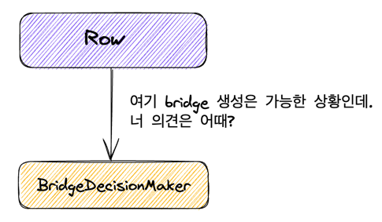

# Step 1 


## 연습 : 자비지기_LadderGame

자바지기님의 영상 에서의 사다리게임 초기 구현을 생각할 때 , 생각해 볼 수 있는 케이스들

- n 명/높이 1/선이 없는 경우
  - 라인 n 에 대한 결과 는 n 이다

- 2명/높이1/선이1개
  ```markdown
  1 1
  ```
  - 결과
    - 0 -> 1
    - 1 -> 0

- 2명/높이2/선이1
  ```markdown
  1 1
  1 1
  ```
  - 결과
    - 0 -> 0
    - 1 -> 1
- 3명/높이1/선이1
  ```markdown
  1 1 0
  ```
  - 결과
    - 0 -> 1
    - 1 -> 0
    - 2 -> 2
- 3명/높이2/선이2
```markdown
  1 1 0
  0 1 1
  - 0 -> 2
  - 1 -> 0
  - 2 -> 1

```

## LadderGame
- 2명 이상의 참여자가 필요하다
  - 사람 수 만큼의 라인을 갖는 사다리를 생성한다
- 사다리의 높이는 1이상 이어야 한다
- 동일한 높이에 다리는 연속할 수 없다
- 다리는 랜덤으로 생성한다


```java
public class Line {
  private List<Boolean> points = new ArrayList<>();

  public Line (int countOfPerson) {
    // 라인의 좌표 값에 선이 있는지 유무를 판단하는 로직 추가
  }
}
```

## Row
- 🤔 미션 자체는 다소 추상적이다. 브릿지 생성과 관련해서는 내가 결정할 사항 같다. 수업 영상도 암것도 없음 ㅠㅠ


```markdown
|  |--|
|--|  |

사다리를 아래와 같이 표현한다고 하였을 때
DOWN LEFT  RIGHT
LEFT RIGHT DOWN
```
위 그림 상의 가로 라인을 의미한다

LEFT RIGTH 한 쌍을 브릿지라고 한다

- 특정 지점이 가리키는 방향이 어디인지 알려준다
  - Row 의 각 지점은 다음 방향을 가리킨다.
- 하나의 Row 에는 브릿지가 연속해서 존재할 수 없다
  - 조건을 만족하는 상황에서 브릿지는 랜덤으로 생성된다. 


